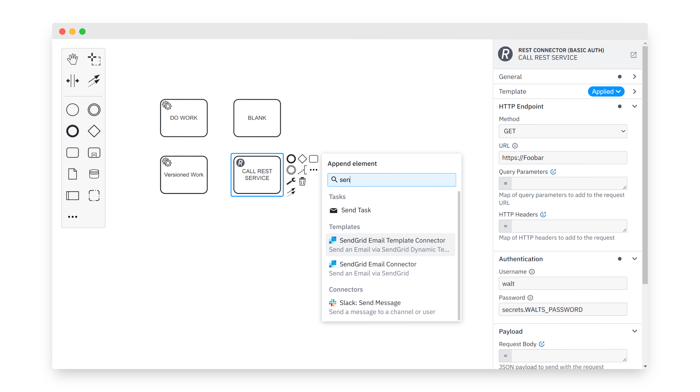

# bpmn-js-create-append-anything

[](https://github.com/bpmn-io/bpmn-js-create-append-anything/actions/workflows/CI.yml)

This module extends [bpmn-js](https://github.com/bpmn-io/bpmn-js) with a create and append anything modeling experience.




## Features

* Create any BPMN element from the palette
* Append any BPMN element from the context pad
* Fully keyboard navigatable (`N` and `A` to open the menus)
* Integration with [element templates](https://github.com/bpmn-io/element-templates) through dedicated extension
  * Create or append templated elements
  * Apply template through the replace menu 


## Installation

Install via npm:

```sh
npm install bpmn-js-create-append-anything
```


## Usage

Use as an extension for [bpmn-js](https://github.com/bpmn-io/bpmn-js):

```javascript
import {
  CreateAppendAnythingModule
} from 'bpmn-js-create-append-anything';

const modeler = new BpmnModeler({
  additionalModules: [
    ...,
    CreateAppendAnythingModule,
    CreateAppendElementTemplatesModule
  ]
});
```

If desired, integrate with [element templates](https://github.com/bpmn-io/element-templates):

```javascript
import {
  CreateAppendAnythingModule,
  CreateAppendElementTemplatesModule
} from 'bpmn-js-create-append-anything';

const modeler = new BpmnModeler({
  additionalModules: [
    ...,
    CreateAppendAnythingModule,
    CreateAppendElementTemplatesModule
  ]
});
```

This relies on `elementTemplates` to be provided via an external module, i.e. [bpmn-js-properties-panel](https://github.com/bpmn-io/bpmn-js-properties-panel).


## Run locally

To get the development setup make sure to have [NodeJS](https://nodejs.org/en/download/) installed.
As soon as you are set up, clone the project and execute

```sh
# install dependencies
npm install

# start a bpmn-js instance with the extension
npm start

# for regular BPMN elements only
npm run start:bpmn
```


## License

MIT
